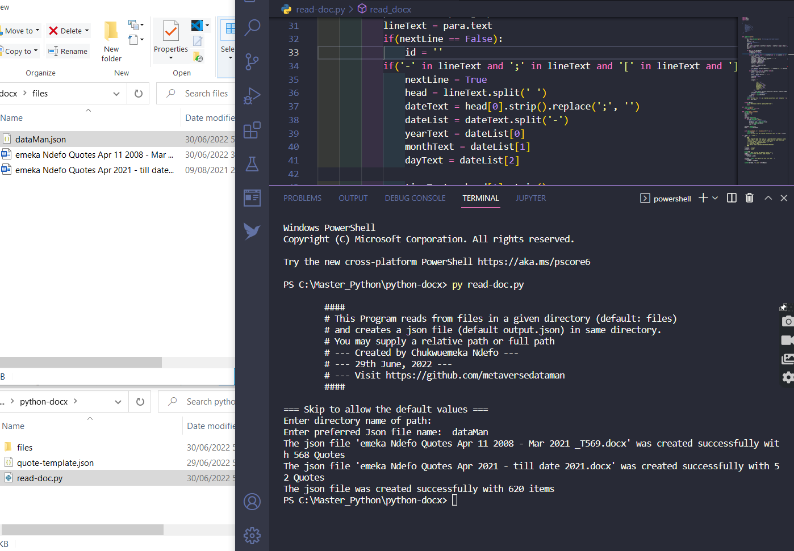

# Python Docx Reader

A python program that reads a MS document from a specified directory. It loops through all the .docx files, and creates only one json file using the extracted data.



[View the Demo][1]

## Document format  


The source data was originally formatted as below

> 2008-03-17; 7:17 am [dq1]

200-03-17 is the date (YYYY-MM-DD)

7:17 is the time (h:i)

am is the meridian (am / pm)

dq1 is the id. The letters, 'dq' are removed

* Note that the semicolon (;) after date is a compulsory marker.
* Both [ and ] enclosing the id are also compulsory markers.
* Any entry in the next line, is stored as the corresponding text.
* Every other thing in the document is skipped.

## JSON Format


```json
{
                        "id": "612",
                        "quote": "The majority are busy running after the DO’s and DON’Ts of life, and vehemently rejecting the Giver of life.",
                        "yearText": "2021",
                        "monthText": "07",
                        "dayText": "18",
                        "timeText": "9:47",
                        "ampm": "pm"
                    }
```


Do visit our website: [https://emexrevolarter.com](https://emexrevolarter.com) for more information on web & mobile solutions.

Thank you for visiting. If you found this repository helpful, please do star it.

  [1]: video/python%20docx%20reader.mp4
